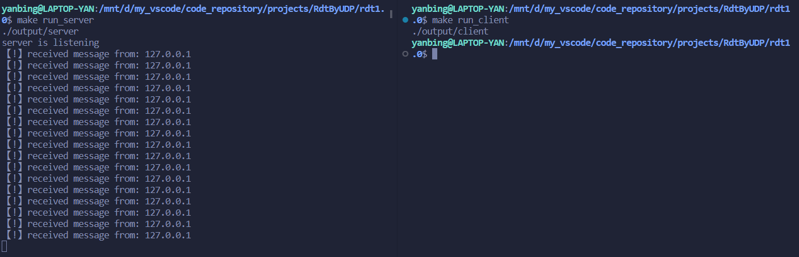
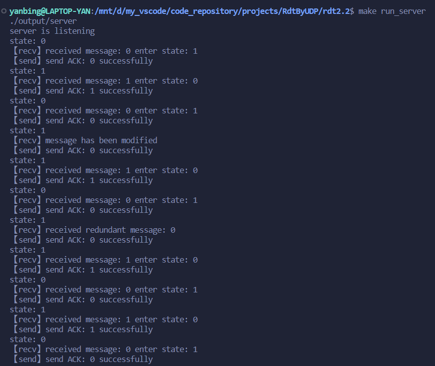
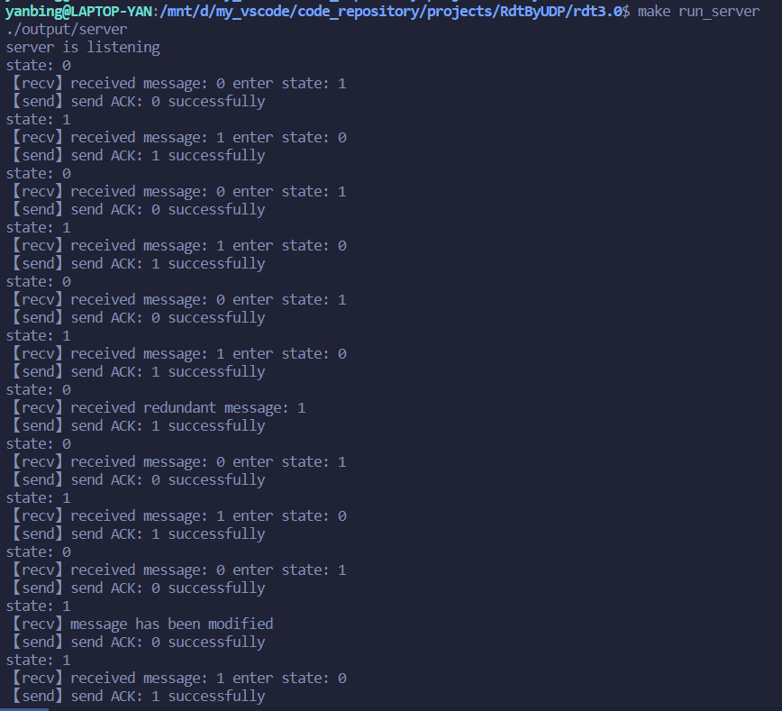
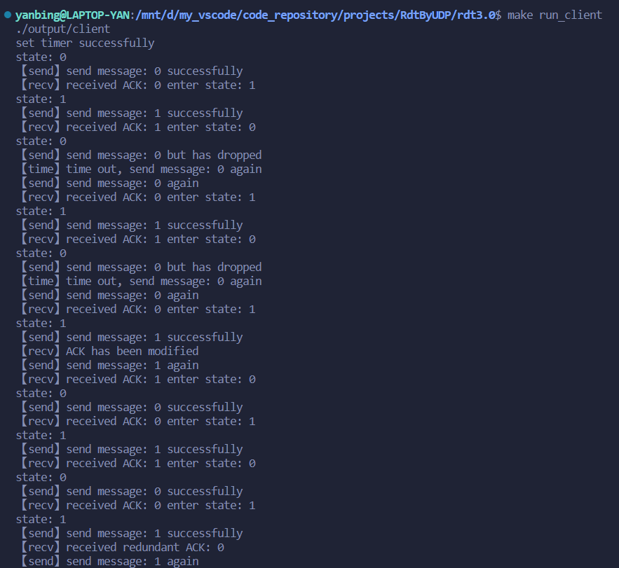

# <center>Socket编程之可靠传输协议RDT.X实验
### <center>2023.11.07

# 实验要求
## 1.基于UDP Socket的rtd1.0协议实现
### 1.1 实验任务
* 假设在信道完全可靠的情况下，基于UDP Socket实现C/S模式下的单向文件传输（Client向Server发送文件）

### 1.2 实验步骤
* 编码实现实现文件传输客户端代码
    - 创建UDP socket对象；
    - 文件拆分，构造传输UDP数据包；
    - 发送数据包至服务器Server
* 编码实现文件传输服务器端代码
    - 创建UDP socket对象；
    - 接收client发送数据包；
    - 组装数据包，形成完整文件。

## 2.基于UDP Socket的rtd2.2协议实现
### 2.1 实验任务
* 假设在信道可能出现比特错误的情况下，基于UDP Socket实现C/S模式下的单向文件传输（Client向Server发送文件）

### 2.2 实验步骤
* 编码实现文件传输客户端代码
    - 构造发送数据包
    - 增加数据报编号机制（0/1）
    - 增加校验码机制
    - 模拟以一定概率发送错误数据包情况
    - 增加接收确认数据包校验出错情况以及对应处理方式
    - 增加接收到重复确认数据包情况以及对应处理方式
* 编码实现文件传输服务器端代码
    - 增加校验码机制
    - 增加确认响应数据报
    - 模拟以一定概率发送错误响应报文情况
    - 增加接收到错误数据报文响应操作


## 3.基于UDP Socket的rtd2.2协议实现
### 3.1 实验任务
* 假设在信道可能出现比特错误且可能丢失包的情况下，基于UDP Socket实现C/S模式下的单向文件传输（Client向Server发送文件）

### 3.2 实验步骤
* 编码实现文件传输客户端代码
    - 模拟以一定概率丢失发送数据包的情况
    - 增加计数模块，响应超时重传
* 编码实现文件传输服务器端代码
    - 模拟以一定概率丢失确认数据包的情况


# 实验内容
## 基础准备
### 1. 封装`UDP Socket`为`UDPsocket`类【文件位于include/UDPsocket.h】
* `UDPSocket`类定义如下：
```cpp
class UDPsocket{
protected:
    //套接字句柄
    int m_socket_fd;
public:
    //发送数据的远程主机IP地址和端口号信息
    sockaddr_in addrrecv;
    socklen_t addrrecv_len;

    //定义缓冲区大小
    static const int BUFSIZE = 1024;
    UDPsocket(int _domain = AF_INET, int _type = SOCK_DGRAM, int _protocol = 0);
    virtual ~UDPsocket();
    //@brief 判断是否成功获取套接字资源
    bool failed(){ return m_socket_fd == -1; };
    //@brief 获取套接字句柄接口
    int getSocket_fd() const{ return m_socket_fd;}
    int init(int level, int optname, const void* optval, socklen_t optlen);

    
    virtual ssize_t send(const void* buf, size_t n, int flags, const sockaddr* addr, socklen_t addr_len);
    virtual ssize_t receive(void* buf, size_t n, int flags, sockaddr* addr, socklen_t* addr_len);
    virtual int bindaddr(const sockaddr* addr, socklen_t len);
    
    virtual ssize_t send(const std::string& buf, int flags, const sockaddr* addr);
    virtual ssize_t receive(std::string& buf, int flags);
    virtual int bindaddr(const sockaddr* addr);
};
```
* `UDPSocket`类将C++提供的Socket编程接口简单封装成类，便于网络套接字资源的管理。
* `UDPSocket`类中简化了C++提供的编程接口，同时保留了对原始接口的支持。

### 2. 封装文件处理类`FileReader`和`FileWriter`【文件位于include/iofile.h】
* `FileReader`类定义如下：
```cpp
class FileReader {
    std::ifstream file;
public:
    FileReader(const std::string& filename);
    ~FileReader();
    bool isEnd() const { return file.eof();}
    std::string readNextBlock(size_t blockSize);
};
```

* `FileWriter`类定义如下：
```cpp
class FileWriter{
    std::ofstream file;
public:
    FileWriter(const std::string& filename);
    ~FileWriter();
    void flush(){file.flush();}
    void writeNextBlock(const std::string& block, unsigned int len);
};
```

* 封装文件处理类`FileReader`和`FileWriter`目的是便于管理文件资源。

### 辅助函数【文件位于include/UDPsocket.h】
* 定义了部分辅助函数
```cpp
//@brief 将32位IP地址转string
//@param addr: 32位ip地址
//@return string形式的IP地址
std::string uint32_t_to_string(uint32_t addr){
    uint8_t* ptr = (uint8_t*)&addr;
    return std::to_string(*ptr)+"."+std::to_string(*(ptr+1))
        +"."+std::to_string(*(ptr+2))+"."+std::to_string(*(ptr+3));
}

//@brief 计算校验和
uint16_t calculateChecksum(const std::string& data) {
    uint32_t sum = 0;
    for (char c : data) {
        sum += static_cast<uint8_t>(c);
    }
    return static_cast<uint16_t>(sum);
}

//@brief 将uint16_t转换为2字节的字符串
std::string uint16ToTwoByteString(uint16_t value) {
    std::stringstream ss;
    ss.write(reinterpret_cast<const char*>(&value), sizeof(value));
    return ss.str();
}
//@brief 将字符串前两个字节转uint16_t
uint16_t twoByteStringToUint16(const std::string& byteString) {
    std::stringstream ss;
    ss.write(byteString.data(), 2);
    uint16_t value;
    ss.read(reinterpret_cast<char*>(&value), sizeof(value));
    return value;
}

//@brief 将字符串第一个字节转uint8_t
uint8_t firstByteStringToUint8(const std::string& byteString) {
    std::stringstream ss;
    ss.write(byteString.data(), 1);
    uint8_t value;
    ss.read(reinterpret_cast<char*>(&value), sizeof(value));
    return value;
}

//@brief 以给定概率修改uint16_t变量的值，概率取0~1
void modify_uint16_t_with_probability(uint16_t &value, double probability) {
    if (static_cast<double>(rand()) / RAND_MAX < probability) {
        value = static_cast<uint16_t>(rand());
    }
}
// 将uint16_t类型转两字节大小的字符串
std::string uint16ToTwoByteString(uint16_t value);
// 将字符串的前两个字节转化为uint16_t类型
uint16_t twoByteStringToUint16(const std::string& byteString);
// 以一定概率修改传入引用的值【模拟bit_error】
void modify_uint16_t_with_probability(uint16_t &value, double probability);
```

# 1.基于UDP Socket的rtd1.0协议实现
## 基于`UDPsocket`类将`rdt1.0`协议封装为协议类`rdt10`
* `rdt10`类定义如下：
```cpp
class Rdt10: public UDPsocket{
public:
    Rdt10();
    ~Rdt10();

    ssize_t send(const void* buf, size_t n, int flags, const sockaddr* addr, socklen_t addr_len);
    ssize_t receive(void* buf, size_t n, int flags, sockaddr* addr, socklen_t* addr_len);
    int bindaddr(const sockaddr* addr, socklen_t len);

    ssize_t send(const std::string& buf, int flags, const sockaddr* addr);
    ssize_t receive(std::string& buf, int flags);
    int bindaddr(const sockaddr* addr); 
};
```
* `rdt10`类实现如下：
```cpp
//rdt1.0协议的实现文件
#include <string>
#include <cstring>
#include "../include/rdt10.h"

Rdt10::Rdt10(): UDPsocket(AF_INET, SOCK_DGRAM, 0) {}
Rdt10::~Rdt10(){ UDPsocket::~UDPsocket();}

//@brief 【原始】
//@param buf  发送消息缓冲区指针
//@param n    发送消息字节数
//@param flags    可选的标志位
//@param addr 目标地址，sockaddr结构体的指针，包含发送数据的远程主机IP地址和端口号信息
//@param addr_len 目标地址字节长度
//@return 发送成功的字节数，否则返回值小于消息字节数
ssize_t Rdt10::send(const void *buf, size_t n, int flags, const sockaddr *addr, socklen_t addr_len){
    return UDPsocket::send(buf, n, flags, addr, addr_len);
}

//@brief 【原始】
//@param buf  存储接收数据的缓冲区
//@param n    接收数据的最大长度
//@param flags    可选的标志位
//@param addr 源地址，sockaddr结构体的指针，包含发送数据的远程主机IP地址和端口号信息
//@param addr_len 存储源地址长度的指针
//@return 实际接收到的数据字节数
ssize_t Rdt10::receive(void *buf, size_t n, int flags, sockaddr *addr, socklen_t *addr_len){
    return UDPsocket::receive(buf, n, flags, addr, addr_len);
}

//@brief 【原始】
//@param addr sockaddr结构体的指针，该结构体包含了要绑定的IP地址和端口号信息
//@param len  addr指向结构体的大小
//@return   成功返回0，否则返回-1
int Rdt10::bindaddr(const sockaddr *addr, socklen_t len){
    return UDPsocket::bindaddr(addr, len);
}

//@brief 【简化】
//@param buf  发送消息缓冲区【string重载版本】
//@param flags    可选的标志位
//@param addr 目标地址，sockaddr结构体的指针，包含发送数据的远程主机IP地址和端口号信息
//@return 发送成功的字节数，否则返回值小于消息字节数
ssize_t Rdt10::send(const std::string &buf, int flags, const sockaddr *addr){
    return UDPsocket::send(buf, flags, addr);
}

//@brief 【简化】
//@param buf  存储接收数据的缓冲区【string重载版本】
//@param flags    可选的标志位
//@return 实际接收到的数据字节数
ssize_t Rdt10::receive(std::string &buf, int flags){
    return UDPsocket::receive(buf, flags);
}

//@brief 【简化】
//@param addr sockaddr结构体的指针，该结构体包含了要绑定的IP地址和端口号信息
//@return   成功返回0，否则返回-1
int Rdt10::bindaddr(const sockaddr *addr){
    return UDPsocket::bindaddr(addr);
}
```
* 基于`rdt1.0`的要求，协议`rdt10`类只是基于`UDPsocket`类方法的简单封装。


## rdt1.0协议实验结果
### client.cpp【文件位于rdt1.0/client.cpp】
```cpp
//udp客户端
#include <iostream>
#include <fstream>
#include <memory>
#include <sys/socket.h>
#include <netinet/in.h>
#include <arpa/inet.h>
#include "../include/rdt10.h"
#include "../include/iofile.h"

using std::string;
using std::cout;
using std::cin;
using std::endl;
using std::cerr;

void client();

int main(){
    srand(time(0));
    client();
    return 0;
}

void client(){
    struct sockaddr_in server_addr{0};
    server_addr.sin_family = AF_INET;
    server_addr.sin_addr.s_addr = inet_addr("127.0.0.1");
    server_addr.sin_port = htons(atoi("6000"));

    //分配网络套接字资源
    std::unique_ptr<Rdt10> socket(new Rdt10());
    if (socket->failed()) {
        cerr << "create socket failed" << endl;
        exit(1);
    }

    //分配读文件资源
    std::unique_ptr<FileReader> fileR(new FileReader("/mnt/d/my_vscode/code_repository/RdtByUDP/send.txt"));

    string message;

    while (!fileR->isEnd()){
        message = fileR->readNextBlock(64);
        socket->send(message, 0, (struct sockaddr *)&server_addr);
    }
}
```
1. 在client函数中，首先定义了一个server_addr结构体，用于存储服务器的地址信息。其中，sin_family表示地址族，sin_addr.s_addr表示IP地址，sin_port表示端口号。

2. 接下来，通过调用unique_ptr的构造函数，创建了一个Rdt10类型的网络套接字资源和一个FileReader类型的读文件资源。

3. 然后，使用while循环从文件中读取数据，每次读取64个字节的数据，直到文件读取完毕。

4. 在循环中，调用socket的send函数，将读取到的数据通过UDP协议发送到指定的服务器。

### server.cpp【文件位于rdt1.0/server.cpp】
```cpp
//udp客户端
#include <iostream>
#include <memory>
#include <sys/types.h>
#include <sys/socket.h>
#include <netinet/in.h>
#include <arpa/inet.h>
#include "../include/Rdt10.h"
#include "../include/iofile.h"

using std::string;
using std::cout;
using std::cin;
using std::endl;
using std::cerr;

static void server();

int main(){
    server();
    return 0;
}

void server(){
    struct sockaddr_in server_addr{0};
    server_addr.sin_family = AF_INET;
    server_addr.sin_addr.s_addr = inet_addr("127.0.0.1");
    server_addr.sin_port = htons(atoi("6000"));

    std::unique_ptr<Rdt10> sev_socket(new Rdt10());
    if (sev_socket->failed()) {
        cerr << "create socket failed" << endl;
        exit(1);
    }

    std::unique_ptr<FileWriter> fileW(new FileWriter("file.txt"));

    if (sev_socket->bindaddr((sockaddr*)&server_addr) == -1){
        cerr << "bind addr failed!" << endl;
        exit(1);
    }

    string recv_message(UDPsocket::BUFSIZE, 0);
    ssize_t recv_len = 0;

    cout <<"server is listening" << endl;

    while(true){
        if ((recv_len = sev_socket->receive(recv_message, 0)) != -1){
            fileW->writeNextBlock(recv_message, recv_len);
            cout << "【!】received message from: " << uint32_t_to_string(sev_socket->addrrecv.sin_addr.s_addr) << endl;
        }
    }
}

```

### 实验结果


# 2.基于UDP Socket的rtd2.2协议实现
## 基于`UDPsocket`类将`rdt2.2`协议封装为协议类`rdt22`
###  `rdt22`类定义如下【文件位于include/rdt22.h】：
```cpp
class Rdt22: public UDPsocket{
    static const double probability;
    uint8_t state;
public:
    Rdt22();
    ~Rdt22();

    int bindaddr(const sockaddr* addr, socklen_t len);
    int bindaddr(const sockaddr* addr); 

    ssize_t ackSend(const std::string& buf, int flags, const sockaddr* addr);
    ssize_t rdt22Receive(std::string& buf, int flags);
    ssize_t rdt22Send(const std::string& buf, int flags, const sockaddr* addr);
    ssize_t ackReceive(std::string& buf, int flags);
};
```
### `rdt22`主要实现如下【文件位于src/rdt22.cpp】：
1. 数据发送方发送数据方法实现：
* 维持状态`state`，记录当前发送方所处状态；
* 调用`modify_uint16_t_with_probability(chksum, probability)`，通过以一定概率修改计算出的校验和`chksum`，以模拟不可靠信道的`bit_error`场景；
    ```cpp
    chksum = calculateChecksum(message);
    //模拟bit_error场景
    modify_uint16_t_with_probability(chksum, probability);
    message = uint16ToTwoByteString(chksum)+ message;
    ```

* 发送消息后，进入停等状态，循环中如果消息被篡改或不是目标ACK，函数将重新计算校验和并重发消息；

* 发送消息成功，并正确接收到`ACK`则更新状态`state`.
    ```cpp
    state = (state+1) % 2;
    ```
* 完整实现如下：

    ```cpp
    //@brief 数据发送方发送数据
    ssize_t Rdt22::rdt22Send(const std::string &buf, int flags, const sockaddr *addr){
        std::string message, seq, flagByte;
        uint16_t chksum = 0;
        ssize_t res = 0;
        std::cout << "state: " << (int)state << std::endl;
        //标志位置0
        flagByte = std::string(1, 0);
        //报文序号
        seq = std::string(1, state);
        message = flagByte + seq + buf;
        chksum = calculateChecksum(message);
        
        //模拟bit_error场景
        modify_uint16_t_with_probability(chksum, probability);
        message = uint16ToTwoByteString(chksum)+ message;

        res = UDPsocket::send(message, flags, addr);
        
        std::cout << "【send】send message: " << (int)state << " successfully" << std::endl;

        //停等
        std::string recv_message(BUFSIZE, 0);
        //接收ACK
        ssize_t recv_len = ackReceive(recv_message, 0);

        //若消息被篡改或不是目标ACK，重发数据
        while (recv_len == -1 || recv_message[1] != char(state)){
            if (recv_len == -1) 
                std::cout << "【recv】ACK has been modified" << std::endl;
            else if (recv_message[1] != char(state))
                std::cout << "【recv】received redundant ACK:" << (int)recv_message[1] << std::endl;

            //重新计算
            message = flagByte + seq + buf;
            chksum = calculateChecksum(message);
            //模拟不可靠信道
            modify_uint16_t_with_probability(chksum, probability);
            message = uint16ToTwoByteString(chksum)+ message;

            res = UDPsocket::send(message, flags, addr);
            std::cout << "【send】send message: "<< (int)state << " again"<< std::endl;
            recv_len = ackReceive(recv_message, 0);
        }
        std::cout << "【recv】received ACK: " << (int)state << " enter state: " << (state+1) % 2<< std::endl;
        //更新状态
        state = (state+1) % 2;
        return res;
    }
    ```


2. 数据接收方接收数据实现：
* 接收报文段，计算校验和，如果计算得到的校验和和接收到的校验和不一致或收到的报文段并非目的报文段，返回-1；
    ```cpp
    uint16_t recvChkSum = twoByteStringToUint16(recv_message);
    recv_message = recv_message.substr(2);

    //数据被篡改或非目标报文
    if (recvChkSum != calculateChecksum(recv_message) || recv_message[1] != char(state)){
        ...
    }
    ```
* 否则，更新状态，并向上传出数据
  ```cpp
    //更新状态
    state = (state+1)%2;
    //否则，获取向上传出数据
    buf = recv_message.substr(2);
  ```

* 完整实现如下：

    ```cpp
    //@brief 数据接收方接收数据
    ssize_t Rdt22::rdt22Receive(std::string &buf, int flags){
        std::string recv_message(BUFSIZE, 0);
        ssize_t ack_res = 0;
        size_t res = UDPsocket::receive(recv_message, flags);
        if (res < 0) return -1;

        std::cout << "state: " << (int)state << std::endl;

        uint16_t recvChkSum = twoByteStringToUint16(recv_message);
        recv_message = recv_message.substr(2);

        //数据被篡改或非目标报文
        if (recvChkSum != calculateChecksum(recv_message) || recv_message[1] != char(state)){
            //若数据被篡改
            if (recvChkSum != calculateChecksum(recv_message)){
                std::cout << "【recv】message has been modified" << std::endl;
                ack_res = ackSend(std::string(char((state+1)%2), 1), 0, (sockaddr*)&addrrecv);
                if (ack_res != -1)
                    std::cout << "【send】send ACK: " << ((int)state+1)%2 << " successfully"<< std::endl;
            }
            else{
                std::cout << "【recv】received redundant message: "<< ((int)state+1)%2 << std::endl;
                ack_res = ackSend(std::string(char((state+1)%2), 1), 0, (sockaddr*)&addrrecv);
                if (ack_res != -1)
                    std::cout << "【send】send ACK: " << ((int)state+1)%2 << " successfully"<< std::endl;
            }
            return -1;
        }

        std::cout << "【recv】received message: "<< (int)state << " enter state: "<< ((int)state+1)%2<< std::endl;
        ackSend(std::string(char(state), 1), 0, (sockaddr*)&addrrecv);
        std::cout << "【send】send ACK: " << (int)state << " successfully"<< std::endl;

        //更新状态
        state = (state+1)%2;
        // 获取向上传出数据
        buf = recv_message.substr(2);

        return res -4;
    }
    ```

## rdt2.2协议实验结果
* 由于封装了协议，client和server代码实现大同小异，便不予以展示，见代码附件
### 实验结果【部分】
* server

* client

  


# 3.基于UDP Socket的rtd3.0协议实现
## 基于`UDPsocket`类将`rdt3.0`协议封装为协议类`rdt30`
###  `rdt30`类定义如下【文件位于include/rdt30.h】：
```cpp
class Rdt30: public UDPsocket{
    static const double probability_bit_error;
    static const double probability_drop_package;
    uint8_t state;
public:
    static const time_t timer;

    Rdt30();
    ~Rdt30();

    int bindaddr(const sockaddr* addr, socklen_t len);
    int bindaddr(const sockaddr* addr); 

    ssize_t ackSend(const std::string& buf, int flags, const sockaddr* addr);
    ssize_t rdt30Receive(std::string& buf, int flags);
    ssize_t rdt30Send(const std::string& buf, int flags, const sockaddr* addr);
    ssize_t ackReceive(std::string& buf, int flags);

    ssize_t send_package_with_probability_drop(const std::string &buf, int flags, const sockaddr *addr, double probability);
};

```

### `rdt30`主要实现如下【文件位于src/rdt30.cpp】：
1. 数据发送方发送数据方法实现：
* 调用`modify_uint16_t_with_probability(chksum, probability)`，通过以一定概率修改计算出的校验和`chksum`，以模拟不可靠信道的`bit_error`场景；
    ```cpp
    chksum = calculateChecksum(message);
    //模拟bit_error场景
    modify_uint16_t_with_probability(chksum, probability);
    message = uint16ToTwoByteString(chksum)+ message;
    ```
* 调用`send_package_with_probability_drop(message, 0, addr, probability_drop_package)`模拟不可靠信道`package_drop`情景
    ```cpp
    //模拟drop_package
    res = send_package_with_probability_drop(message, 0, addr, probability_drop_package);
    if (res < 0) std::cout << "【send】send message: " << (int)state << " but has dropped" << std::endl;
    else std::cout << "【send】send message: " << (int)state << " successfully" << std::endl;
    ```

* `client`调用`rdt30`父类`UDPsocket`的`init`方法，设置等待时间
    ```cpp
    //设置超时
    timeval timeout;
    timeout.tv_sec = socket->timer; // 超时时间为5秒
    timeout.tv_usec = 0;

    if (!socket->init(SOL_SOCKET, SO_RCVTIMEO, (char *)&timeout, sizeof(timeout)))
        std::cout << "set timer successfully" << std::endl;
    else std::cout << "set timer failed" << std::endl;
    ```
* 发送报文段后，停等，若消息超时、被篡改或不是目标ACK，重发数据
    ```cpp
    //停等
    std::string recv_message(BUFSIZE, 0);
    ssize_t recv_len = 0;
    //接收ACK
    recv_len = ackReceive(recv_message, 0);
    //std::cout << "recv_len: "<< recv_len << std::endl;

    //若消息超时、被篡改或不是目标ACK，重发数据
    while (recv_len == -1 || recv_len == -2 || recv_message[1] != char(state)){
        if (recv_len == -1)
            std::cout << "【time】time out, send message: " << (int)state << " again" << std::endl;
        else if (recv_len == -2)
            std::cout << "【recv】ACK has been modified" << std::endl;
        else if ( recv_message[1] != char(state))
            std::cout << "【recv】received redundant ACK: " << (int)recv_message[1] << std::endl;
        ...
    }

    ```

* 否则，更新状态
    ```cpp
    //更新状态
    state = (state+1) % 2;
    ```

* 完整实现如下：
    ```cpp
    //@brief 数据发送方发送数据，以一定概率发送失败模拟丢包
    ssize_t Rdt30::rdt30Send(const std::string &buf, int flags, const sockaddr *addr){
        std::string message, seq, flagByte;
        uint16_t chksum = 0;
        ssize_t res = 0;

        std::cout << "state: " << (int)state << std::endl;

        //标志位置0
        flagByte = std::string(1, 0);
        //报文序号
        seq = std::string(1, state);
        message = flagByte + seq + buf;
        chksum = calculateChecksum(message);
        
        //模拟bit_error
        modify_uint16_t_with_probability(chksum, probability_bit_error);
        message = uint16ToTwoByteString(chksum)+ message;

        //模拟drop_package
        res = send_package_with_probability_drop(message, 0, addr, probability_drop_package);
        if (res < 0) std::cout << "【send】send message: " << (int)state << " but has dropped" << std::endl;
        else std::cout << "【send】send message: " << (int)state << " successfully" << std::endl;

        //停等
        std::string recv_message(BUFSIZE, 0);
        ssize_t recv_len = 0;
        //接收ACK
        recv_len = ackReceive(recv_message, 0);
        //std::cout << "recv_len: "<< recv_len << std::endl;

        //若消息超时、被篡改或不是目标ACK，重发数据
        while (recv_len == -1 || recv_len == -2 || recv_message[1] != char(state)){
            if (recv_len == -1)
                std::cout << "【time】time out, send message: " << (int)state << " again" << std::endl;
            else if (recv_len == -2)
                std::cout << "【recv】ACK has been modified" << std::endl;
            else if ( recv_message[1] != char(state))
                std::cout << "【recv】received redundant ACK: " << (int)recv_message[1] << std::endl;

            //重新计算
            message = flagByte + seq + buf;
            chksum = calculateChecksum(message);
            //模拟不可靠信道
            modify_uint16_t_with_probability(chksum, probability_bit_error);
            message = uint16ToTwoByteString(chksum)+ message;

            //模拟drop_package
            res = send_package_with_probability_drop(message, 0, addr, probability_drop_package);
            if (res < 0) std::cout << "【send】send message: " << (int)state << " again, but has dropped" << std::endl;
            else std::cout << "【send】send message: "<< (int)state << " again"<< std::endl;

            recv_len = ackReceive(recv_message, 0);
        }
        std::cout << "【recv】received ACK: " << (int)state << " enter state: " << (state+1) % 2<< std::endl;
        //更新状态
        state = (state+1) % 2;
        return res;
    }
    ```

2. 数据接收方接收数据方法实现：
* `rdt30`的数据接收方和`rdt22`的数据接收方实现思路大同小异。

* 完整实现如下：
    ```cpp
    //@brief 数据接收方接收数据
    ssize_t Rdt30::rdt30Receive(std::string &buf, int flags){
        std::string recv_message(BUFSIZE, 0);
        ssize_t ack_res = 0;
        size_t res = UDPsocket::receive(recv_message, flags);
        if (res < 0) return -1;

        std::cout << "state: " << (int)state << std::endl;

        uint16_t recvChkSum = twoByteStringToUint16(recv_message);
        recv_message = recv_message.substr(2);

        //数据被篡改或非目标报文
        if (recvChkSum != calculateChecksum(recv_message) || recv_message[1] != char(state)){
            //若数据被篡改
            if (recvChkSum != calculateChecksum(recv_message)){
                std::cout << "【recv】message has been modified" << std::endl;
                ack_res = ackSend(std::string(char((state+1)%2), 1), 0, (sockaddr*)&addrrecv);
                if (ack_res != -1)
                    std::cout << "【send】send ACK: " << ((int)state+1)%2 << " successfully"<< std::endl;
            }
            else{
                std::cout << "【recv】received redundant message: "<< ((int)state+1)%2 << std::endl;
                ack_res = ackSend(std::string(char((state+1)%2), 1), 0, (sockaddr*)&addrrecv);
                if (ack_res != -1)
                    std::cout << "【send】send ACK: " << ((int)state+1)%2 << " successfully"<< std::endl;
            }
            return -1;
        }

        std::cout << "【recv】received message: "<< (int)state << " enter state: "<< ((int)state+1)%2<< std::endl;
        ackSend(std::string(char(state), 1), 0, (sockaddr*)&addrrecv);
        std::cout << "【send】send ACK: " << (int)state << " successfully"<< std::endl;

        //更新状态
        state = (state+1)%2;
        //否则，获取向上传出数据
        buf = recv_message.substr(2);

        return res -4;
    }
    ```

3. 模拟不可靠信道`package_drop`
   ```cpp
   //@brief 模拟丢包场景，返回-1表示丢包
    ssize_t Rdt30::send_package_with_probability_drop(const std::string &buf, int flags, const sockaddr *addr, double probability){
        if (static_cast<double>(rand()) / RAND_MAX < probability)
            return -1;
        return UDPsocket::send(buf, flags, addr);
    }
   ```

## `rdt3.0`协议实验结果
1. client
*  `client`调用`rdt30`父类`UDPsocket`的`init`方法，设置等待时间
    ```cpp
    //设置超时
    timeval timeout;
    timeout.tv_sec = socket->timer; // 超时时间为5秒
    timeout.tv_usec = 0;

    if (!socket->init(SOL_SOCKET, SO_RCVTIMEO, (char *)&timeout, sizeof(timeout)))
        std::cout << "set timer successfully" << std::endl;
    else std::cout << "set timer failed" << std::endl;
    ```

### 实验结果
* server
  

* client
  